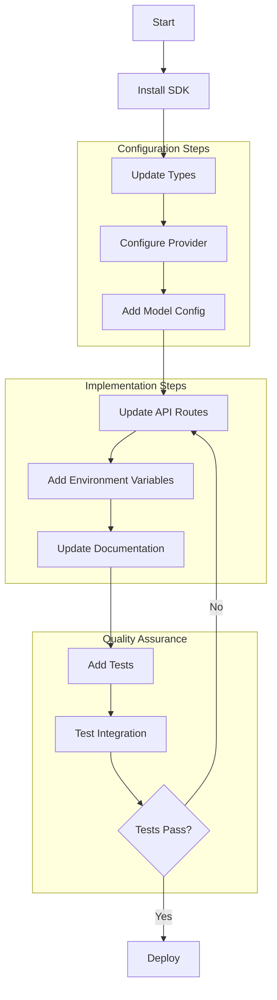

````markdown path=docs/how-to-add-llm-provider.md mode=EDIT
# How to Add a New LLM Provider and Model

This guide provides step-by-step instructions for adding a new LLM provider and model to the system.

## Flow Diagram



## Step-by-Step Implementation

### 1. Install Provider SDK

Add the provider's SDK to your project dependencies:

<augment_code_snippet path="package.json" mode="EDIT">
```json
{
  "dependencies": {
    "@ai-sdk/new-provider": "^1.0.0"
  }
}
````

Install dependencies:
```bash
pnpm install
```

### 2. Update Type Definitions

Add the new provider to the `ModelProvider` type:

````typescript path=lib/ai-agents/types.ts mode=EDIT
export type ModelProvider = 
  | 'anthropic' 
  | 'openai' 
  | 'google' 
  | 'groq' 
  | 'mistral' 
  | 'openrouter' 
  | 'perplexity' 
  | 'new-provider';

// Add provider-specific configuration types
export interface NewProviderConfig {
  temperature?: number;
  maxTokens?: number;
  customOption?: string;
}
````

### 3. Configure Provider Integration

Add the provider to the models configuration:

````typescript path=lib/models.ts mode=EDIT
import { newProvider } from "@ai-sdk/new-provider";

// Add provider instance
export const myProvider = customProvider({
  languageModels: {
    // Existing models...
    "new-model-id": newProvider("new-model-name"),
    "new-model-id-2": newProvider("new-model-name-2"),
  },
});

// Add API name mappings
export const modelApiNames: Record<string, string> = {
  // Existing mappings...
  "new-model-id": "new-model-name",
  "new-model-id-2": "new-model-name-2",
};

// Add model metadata
export const models: Array<Model> = [
  // Existing models...
  {
    id: "new-model-id",
    name: "New Model Display Name",
    description: "Description of capabilities",
    features: {
      multimodal: true,
      streaming: true,
      reasoning: false,
    },
    contextWindow: 32000,
    pricing: {
      input: 0.0001,
      output: 0.0002,
    },
  },
];
````

### 4. Add Model Configuration

Update the available models list:

````typescript path=lib/ai-agents/types.ts mode=EDIT
export const AVAILABLE_MODELS: ModelConfig[] = [
  // Existing models...
  {
    provider: 'new-provider',
    model: 'new-model-id',
    label: 'New Model Display Name',
    capabilities: {
      text: true,
      images: true,
      audio: false,
    },
  },
];
````

### 5. Update API Routes

Add provider-specific handling in route handlers:

````typescript path=app/api/chat/route.ts mode=EDIT
// Configure provider-specific options
if (modelId.includes("new-model")) {
  providerOptions.newProvider = {
    temperature: 0.2,
    model: apiModelName,
    // Add any provider-specific options
    customOption: "value",
  };
}

// Add multimodal support if needed
if (messagesHaveImage && modelId.startsWith("new-model")) {
  providerOptions.newProvider.imageHandling = {
    enabled: true,
    maxSize: "10MB",
  };
}
````

### 6. Environment Configuration

Add required environment variables:

````bash path=.env.example mode=EDIT
# New Provider API Configuration
NEW_PROVIDER_API_KEY=your-api-key
NEW_PROVIDER_ORG_ID=your-org-id
NEW_PROVIDER_BASE_URL=https://api.provider.com/v1
````

### 7. Update Documentation

Update the README with new provider information:

````markdown path=README.md mode=EDIT
## Supported Models

### New Provider
- **New Model Display Name**
  - Capabilities: Text, Images
  - Context Window: 32K tokens
  - Best for: [Use cases]
  - [Documentation Link](https://docs.provider.com)

## Environment Variables

Required API keys:
- `NEW_PROVIDER_API_KEY` - Get from [Provider Dashboard](https://dashboard.provider.com)
````

### 8. Add Tests

Create provider-specific tests:

````typescript path=lib/__tests__/models.test.ts mode=EDIT
describe('New Provider Integration', () => {
  test('should configure models correctly', () => {
    const newProviderModels = models.filter(
      model => model.id.startsWith("new-model")
    );
    expect(newProviderModels.length).toBeGreaterThan(0);
    
    for (const model of newProviderModels) {
      const languageModel = myProvider.languageModel(model.id);
      expect(languageModel).toBeDefined();
    }
  });

  test('should handle provider-specific options', async () => {
    const result = await myProvider.languageModel("new-model-id").complete({
      prompt: "Test prompt",
      temperature: 0.2,
      customOption: "value",
    });
    expect(result).toBeDefined();
  });

  test('should handle multimodal input if supported', async () => {
    const model = models.find(m => m.id === "new-model-id");
    if (model?.features.multimodal) {
      const result = await myProvider.languageModel("new-model-id").complete({
        messages: [
          {
            role: "user",
            content: [
              { type: "text", text: "Describe this image" },
              { type: "image", url: "test-image.jpg" },
            ],
          },
        ],
      });
      expect(result).toBeDefined();
    }
  });
});
````

## Testing Checklist

1. Basic Integration
   - [ ] Model initialization
   - [ ] API key configuration
   - [ ] Simple completion request

2. Features
   - [ ] Streaming responses
   - [ ] Multimodal support (if applicable)
   - [ ] Error handling
   - [ ] Rate limiting

3. Edge Cases
   - [ ] Token limit handling
   - [ ] Invalid input handling
   - [ ] API error recovery
   - [ ] Connection timeout handling

## Deployment Steps

1. Add API keys to production environment
2. Deploy updated dependencies
3. Monitor initial requests
4. Set up logging and alerts

## Troubleshooting Guide

### Common Issues

1. API Authentication
```bash
Error: Invalid API key
Solution: Check API key format and environment variables
```

2. Rate Limiting
```bash
Error: Too many requests
Solution: Implement exponential backoff
```

3. Model Configuration
```bash
Error: Model not found
Solution: Verify model ID and availability
```

## Best Practices

1. Error Handling
   - Implement retries with backoff
   - Provide meaningful error messages
   - Log errors for debugging

2. Performance
   - Cache responses when appropriate
   - Monitor token usage
   - Implement request queuing

3. Security
   - Secure API key storage
   - Validate input
   - Sanitize output

## Additional Resources

- [Provider API Documentation](https://docs.provider.com)
- [SDK Reference](https://github.com/provider/sdk)
- [Example Implementations](https://github.com/provider/examples)
```
</augment_code_snippet>

This comprehensive guide includes a clear flow diagram, detailed implementation steps, testing procedures, and best practices for adding new LLM providers and models to the system. Would you like me to explain any specific part in more detail?
