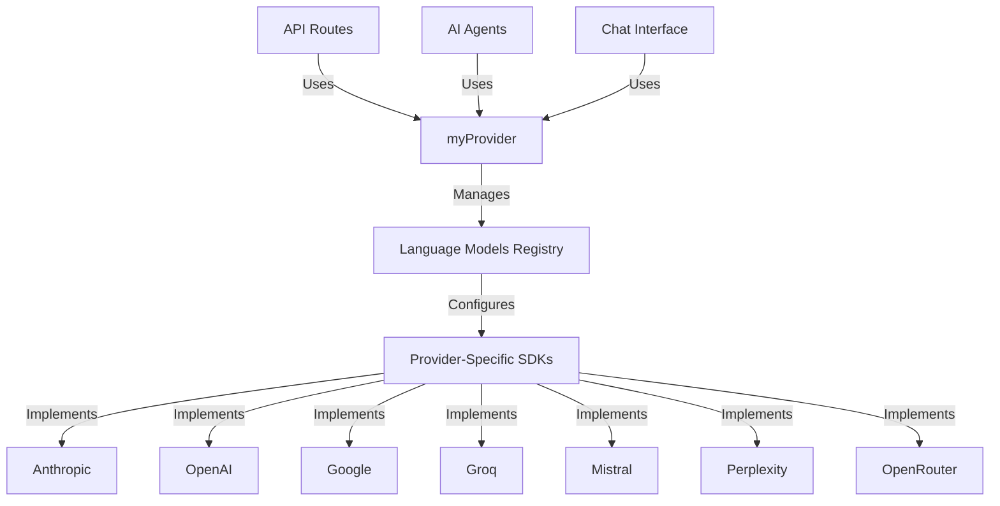

# LLM Provider Architecture

## Overview
The system uses a unified provider architecture to interact with multiple Language Model providers through a consistent interface.

## Architecture Diagram



## Core Components

### 1. Provider Registry (`lib/models.ts`)
```typescript
export const myProvider = customProvider({
  languageModels: {
    "claude-3.7-sonnet": anthropic("claude-3-7-sonnet-20250219"),
    "claude-3.5-haiku": anthropic("claude-3-5-haiku-latest"),
    "o3-mini": openai("o3-mini"),
    "gemini-2.0-flash": google("gemini-2.0-flash"),
    "qwen-qwq-32b": groq("qwen-qwq-32b"),
    "codestral-latest": mistral("codestral-latest"),
    "perplexity sonar": perplexity("sonar"),
    "google/gemini-2.0-flash-thinking-exp:free": openrouter("google/gemini-2.0-flash-thinking-exp:free"),
  },
});
```

### 2. Model Configuration Types (`lib/ai-agents/types.ts`)
```typescript
export type ModelProvider = 'anthropic' | 'openai' | 'google' | 'groq' | 
                          'mistral' | 'openrouter' | 'perplexity';

export type ModelConfig = {
  provider: ModelProvider;
  model: string;
  label: string;
};
```

### 3. Provider-Specific Options
```typescript
const providerOptions: Record<string, any> = {
  anthropic: {
    thinking: {
      type: isReasoningEnabled ? "enabled" : "disabled",
      budgetTokens: 12000,
    }
  },
  openai: {
    temperature: 0.2
  },
  google: {
    temperature: 0.2
  },
  // ... other provider configurations
};
```

## Provider Selection Logic

### 1. Default Model Selection
```typescript
// Default to Claude 3.7 Sonnet if no model is selected
let modelId = selectedModelId || "claude-3.7-sonnet";
```

### 2. Capability-Based Selection
```typescript
// Override model selection for multimodal content
if (messagesHavePDF) {
  if (!modelId.startsWith("gemini")) {
    modelId = "gemini-2.0-flash";
  }
} else if (messagesHaveImage) {
  if (!modelId.startsWith("gemini") && 
      !modelId.startsWith("o3") && 
      !modelId.startsWith("gemini")) {
    modelId = "gemini-2.0-flash";
  }
}
```

## Usage Examples

### 1. Basic Usage
```typescript
const stream = streamText({
  model: myProvider.languageModel(modelId),
  messages,
  providerOptions,
});
```

### 2. AI Agents Implementation
```typescript
const result = streamText({
  model: getModelInstance(primaryModel as ModelConfig),
  system: promptManager.compilePrompt('ai-agent', {
    SEARCH_DEPTH: 'advanced',
    RESPONSE_STYLE: 'concise'
  }),
  messages: messages,
  toolChoice: 'required',
  tools: {
    // Tool configurations
  }
});
```

## Provider-Specific Features

### 1. Anthropic (Claude)
- Extended thinking capabilities
- Token budget management
- PDF and image analysis

### 2. Google (Gemini)
- Multimodal support
- Flash thinking mode
- Advanced search integration

### 3. OpenAI
- Efficient mini models
- Temperature control
- Structured output

### 4. Specialized Providers
- Groq: High-performance inference
- Mistral: Code-specific models
- Perplexity: Research-focused
- OpenRouter: Multi-model access

## Error Handling

```typescript
try {
  const stream = streamText({
    model: myProvider.languageModel(modelId),
    messages,
  });
} catch (error) {
  if (error.code === 'provider_error') {
    // Handle provider-specific errors
  } else if (error.code === 'model_not_found') {
    // Handle model availability issues
  }
}
```

## Best Practices

1. Model Selection
   - Use capability-based selection for specific tasks
   - Implement fallback mechanisms
   - Consider cost and performance tradeoffs

2. Provider Configuration
   - Maintain consistent temperature settings
   - Configure appropriate token limits
   - Enable provider-specific optimizations

3. Error Management
   - Handle provider-specific error codes
   - Implement graceful fallbacks
   - Monitor provider health

4. Performance Optimization
   - Cache provider instances
   - Reuse connections when possible
   - Monitor token usage