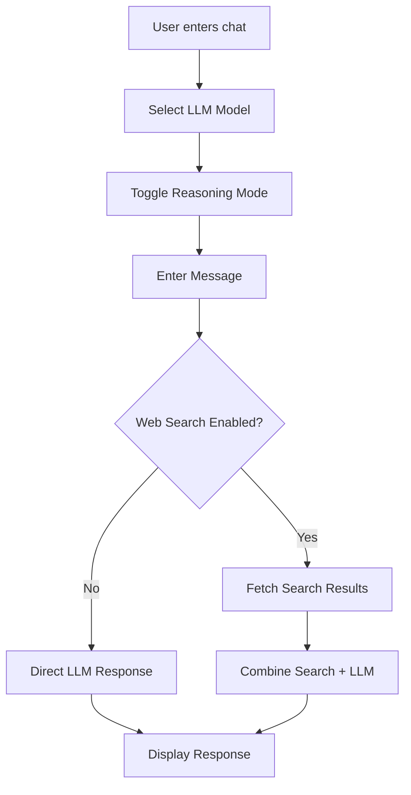
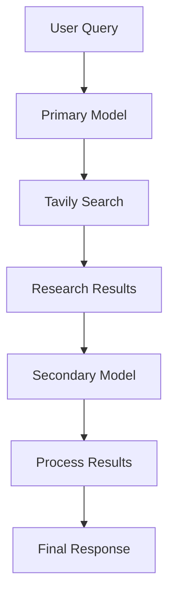
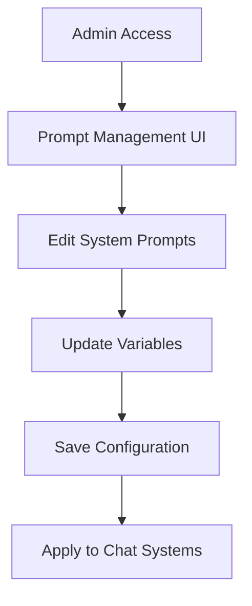
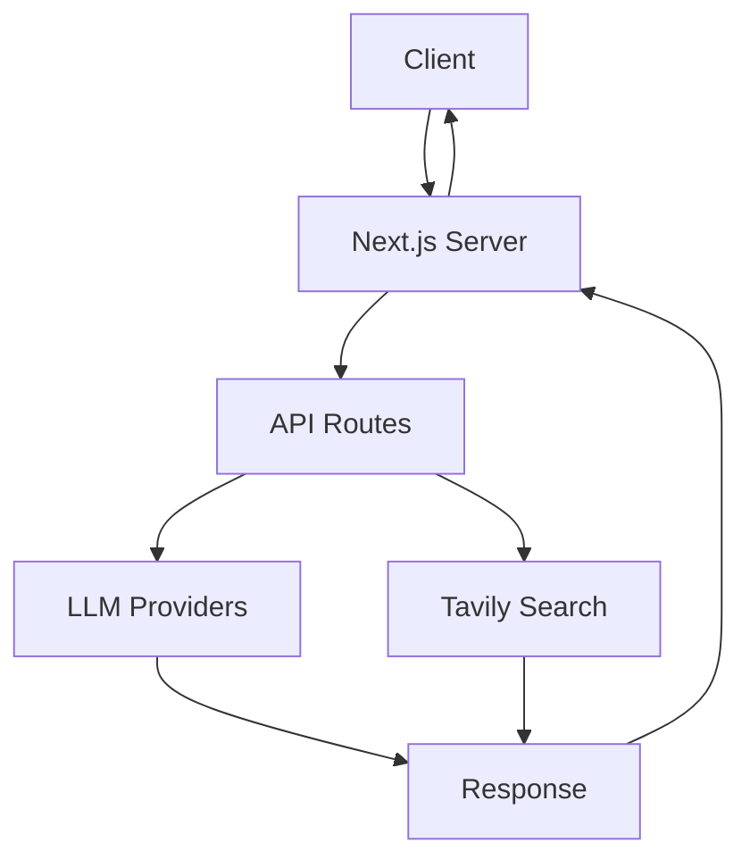

# Project Structure, UI/UX Flow, and Architecture Guide

## Project Structure

```
├── app/
│   ├── ai-agents/
│   │   └── page.tsx           # AI Agents interface
│   ├── tavily-ai-search/
│   │   └── page.tsx           # Tavily search interface
│   ├── admin/
│   │   └── prompts/
│   │       └── page.tsx       # Prompt management interface
│   ├── layout.tsx             # Root layout with sidebar
│   ├── page.tsx               # Main chat interface
│   └── globals.css            # Global styles
├── components/
│   ├── ai-agents/
│   │   ├── agent-chat.tsx
│   │   └── agent-response.tsx
│   ├── chat/
│   │   ├── chat-input.tsx
│   │   ├── chat-messages.tsx
│   │   └── model-selector.tsx
│   ├── tavily-chat/
│   │   ├── search-toggle.tsx
│   │   └── search-results.tsx
│   ├── sidebar/
│   │   ├── sidebar.tsx
│   │   └── sidebar-links.tsx
│   └── ui/                    # Reusable UI components
├── lib/
│   ├── models/               # LLM provider integrations
│   ├── search/              # Tavily search implementation
│   ├── prompts/             # Prompt management system
│   └── utils/               # Utility functions
└── public/                  # Static assets
```

## UI/UX Flow

### 1. Main Chat Interface


### 2. AI Agents Flow


### 3. Prompt Management Flow


## Component Architecture

### 1. Core Components

#### Chat Component
- Purpose: Main chat interface
- Key Features:
  - Model selection
  - Reasoning mode toggle
  - Message history
  - Stream responses
- State Management:
  ```typescript
  interface ChatState {
    messages: Message[];
    model: string;
    reasoningMode: boolean;
    loading: boolean;
  }
  ```

#### AI Agents Component
- Purpose: Multi-model processing
- Features:
  - Primary model research
  - Secondary model synthesis
  - Search integration
  - Result logging

#### Tavily Search Component
- Purpose: Web search integration
- Features:
  - Search toggle
  - Domain filtering
  - Result display
  - Context injection

### 2. UI Components

#### Sidebar
- Navigation links
- Model selection
- Feature toggles
- Settings access

#### Message Components
```typescript
interface MessageProps {
  role: 'user' | 'assistant';
  content: string;
  model?: string;
  timestamp: Date;
}
```

#### Input Components
- Chat input
- Search toggle
- Model selector
- Reasoning toggle

## State Management

### 1. Global State
```typescript
interface GlobalState {
  selectedModel: string;
  reasoningMode: boolean;
  searchEnabled: boolean;
  systemPrompts: Record<string, string>;
}
```

### 2. Local Component State
```typescript
interface ComponentState {
  loading: boolean;
  error: Error | null;
  messages: Message[];
  searchResults: SearchResult[];
}
```

## Data Flow

### 1. Chat Flow
1. User input received
2. Optional web search performed
3. Context assembled
4. LLM request made
5. Response streamed
6. UI updated

### 2. Search Flow
1. Search toggle checked
2. Query processed
3. Tavily API called
4. Results filtered
5. Context injected
6. Combined with LLM

## API Integration

### 1. LLM Providers
- Anthropic Claude
- OpenAI
- Google Gemini
- Groq
- Mistral
- Perplexity
- OpenRouter

### 2. Search Integration
- Tavily API
- Domain filtering
- Result processing
- Context formatting

## Error Handling

### 1. API Errors
```typescript
interface APIError {
  code: string;
  message: string;
  provider?: string;
  timestamp: Date;
}
```

### 2. UI Error States
- Loading states
- Error messages
- Retry mechanisms
- Fallback options

## Performance Optimization

### 1. Client-side
- Response streaming
- Message batching
- UI virtualization
- State caching

### 2. Server-side
- API request pooling
- Response caching
- Rate limiting
- Error recovery

## Security Considerations

### 1. API Security
- Key management
- Request validation
- Rate limiting
- Error sanitization

### 2. Data Security
- Message encryption
- Session management
- Input sanitization
- Output validation

## Testing Strategy

### 1. Component Testing
- Unit tests
- Integration tests
- E2E tests
- Performance tests

### 2. API Testing
- Provider tests
- Search tests
- Error handling
- Rate limiting

## Deployment Architecture

### 1. Production Setup


### 2. Scaling Considerations
- Load balancing
- API quotas
- Cache strategies
- Error handling

## Monitoring and Logging

### 1. Performance Metrics
- Response times
- Error rates
- API usage
- Search quality

### 2. User Analytics
- Model usage
- Feature adoption
- Error patterns
- User feedback

## Future Enhancements

### 1. Planned Features
- Additional models
- Enhanced search
- Custom prompts
- Analytics dashboard

### 2. Technical Debt
- Code optimization
- Test coverage
- Documentation
- Performance tuning

## Documentation

### 1. Technical Docs
- API reference
- Component specs
- State management
- Testing guides

### 2. User Guides
- Feature usage
- Model selection
- Search options
- Troubleshooting
