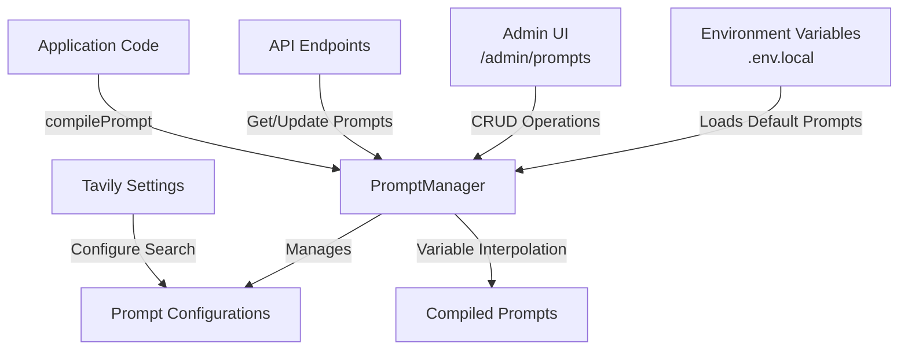

# Prompt Management System Documentation

## Overview
The Prompt Management System provides a centralized way to manage, edit, and compile system prompts with variable interpolation. It consists of several components working together to provide flexible prompt management capabilities.

## System Architecture



## Components

### 1. Environment Variables (.env.local)
Configure default prompts and their content:

```env
# System Prompts
MAIN_CHAT_PROMPT="You are an professional and mindful expert {{USER_ROLE}} AI trainer... {{MODEL_ID}} model."
TAVILY_CHAT_PROMPT="You are an AI researcher focusing on {{SEARCH_DEPTH}}..."
AI_AGENT_PROMPT="You are an expert researcher who uses {{SEARCH_DEPTH}}..."
```

### 2. Prompt Configuration Interface
```typescript
interface PromptConfig {
  id: string;                    // Unique identifier
  name: string;                  // Display name
  content: string;               // Prompt content with variables
  description?: string;          // Optional description
  variables?: string[];         // List of supported variables
  tavilySettings?: TavilySettings; // Tavily-specific settings
}

interface TavilySettings {
  searchDepth: "basic" | "advanced";
  maxResults: number;
  includeAnswer: boolean;
  includeRawContent: boolean;
  includeDomains?: string[];
  excludeDomains?: string[];
  topic?: "general" | "news" | "finance";
  timeRange?: "year" | "month" | "week" | "day";
}
```

### 3. Variable Interpolation
The system supports dynamic variable replacement using the `{{VARIABLE_NAME}}` syntax:

- Common variables:
  - `{{USER_ROLE}}`: User's role/expertise
  - `{{MODEL_ID}}`: Active language model
  - `{{SEARCH_DEPTH}}`: Search depth setting
  - `{{SEARCH_RESULTS}}`: Search results data
  - `{{TAVILY_INCLUDE_DOMAINS}}`: Included domains
  - `{{TAVILY_INCLUDE_ANSWER}}`: Answer inclusion flag

### 4. Using the PromptManager

```typescript
// Initialize
const promptManager = new PromptManager();

// Compile a prompt with variables
const compiledPrompt = promptManager.compilePrompt('main-chat', {
  USER_ROLE: 'AI researcher',
  MODEL_ID: 'claude-3',
  EXPERTISE_LEVEL: 'advanced'
});

// Get all prompts
const allPrompts = promptManager.getAllPrompts();

// Update a prompt
promptManager.setPrompt('main-chat', {
  ...existingConfig,
  content: updatedContent
});
```

### 5. Admin UI Integration

The PromptEditor component (`/admin/prompts`) provides a user interface for:
- Selecting prompts
- Editing prompt content
- Configuring Tavily settings
- Managing variables
- Real-time preview

```typescript
function PromptEditor() {
  const [selectedPrompt, setSelectedPrompt] = useState<string>();
  const [prompts, setPrompts] = useState<PromptConfig[]>([]);

  // Load prompts
  useEffect(() => {
    const loadPrompts = async () => {
      const response = await fetch('/api/prompts');
      const data = await response.json();
      setPrompts(data.prompts);
    };
    loadPrompts();
  }, []);

  // Save prompt changes
  const handleSave = async (promptId: string, config: PromptConfig) => {
    await fetch('/api/prompts', {
      method: 'POST',
      body: JSON.stringify({ id: promptId, config })
    });
  };
}
```

## Best Practices

1. Variable Management:
   - Document all variables in the prompt configuration
   - Use descriptive variable names
   - Provide default values when possible

2. Prompt Content:
   - Keep prompts modular and focused
   - Include clear instructions
   - Document expected behavior

3. Tavily Settings:
   - Configure search depth based on use case
   - Optimize maxResults for performance
   - Carefully manage domain inclusions/exclusions

4. Error Handling:
   - Validate prompt configurations
   - Handle missing variables gracefully
   - Log compilation errors

## Example Usage

```typescript
// In API route
export async function POST(req: Request) {
  const { messages, modelId } = await req.json();
  
  const systemPrompt = promptManager.compilePrompt('main-chat', {
    MODEL_ID: modelId,
    USER_ROLE: 'AI researcher',
    EXPERTISE_LEVEL: 'advanced'
  });

  const stream = await streamText({
    system: systemPrompt,
    messages,
    model: getModelInstance(modelId)
  });

  return new StreamingTextResponse(stream);
}
```

## Debugging

1. Enable debug logging:
```typescript
const DEBUG = process.env.DEBUG_PROMPTS === 'true';
if (DEBUG) {
  console.log('Compiled prompt:', compiledPrompt);
  console.log('Variables used:', variables);
}
```

2. Monitor prompt usage:
```typescript
// Add to PromptManager
private logPromptUsage(id: string, vars: Record<string, string>) {
  console.log(`Prompt ${id} compiled with vars:`, vars);
}
```

## Common Issues and Solutions

1. Missing Variables
- Issue: Variables not being replaced
- Solution: Verify variable names match exactly, including case

2. Invalid Configurations
- Issue: Prompt compilation fails
- Solution: Validate configurations before saving

3. Performance
- Issue: Slow prompt compilation
- Solution: Cache compiled prompts when variables are static