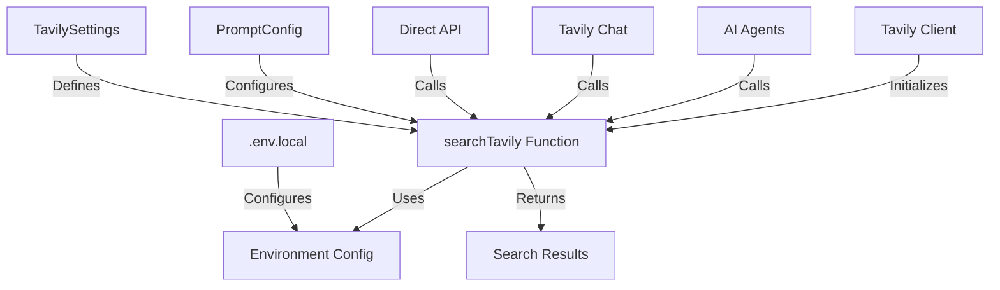

# Tavily Search Integration

## Architecture Diagram



## Core Components

### 1. Tavily Client Configuration (`tools/tavily-search.ts`)
```typescript
export const tavilyClient = (apiKey?: string) => {
  const key = apiKey || process.env.TAVILY_API_KEY;
  if (!key) {
    throw new Error("No Tavily API key provided");
  }
  return tavily({ apiKey: key });
};
```

### 2. Search Parameters Interface
```typescript
export interface TavilySearchParams {
  query: string;
  searchDepth?: "basic" | "advanced";
  maxResults?: number;
  includeAnswer?: boolean;
  includeRawContent?: boolean;
  includeDomains?: string[];
  excludeDomains?: string[];
  modelId?: string;
  topic?: "general" | "news" | "finance";
  days?: number;
  maxTokens?: number;
  timeRange?: "year" | "month" | "week" | "day" | "y" | "m" | "w" | "d";
  chunksPerSource?: number;
}
```

### 3. Environment Configuration (`.env.local`)
```env
# Tavily Search Parameters
TAVILY_API_KEY=tvly-xxx
TAVILY_SEARCH_DEPTH="advanced"
TAVILY_MAX_RESULTS=20
TAVILY_INCLUDE_ANSWER=true
TAVILY_INCLUDE_RAW_CONTENT=false
TAVILY_INCLUDE_DOMAINS="example.com, another-site.com"
TAVILY_EXCLUDE_DOMAINS="exclude.com, block-this.com"
```

## Integration Methods

### 1. Direct API Usage (`app/api/tavily-search/route.ts`)
```typescript
export async function POST(request: NextRequest) {
  const params: TavilySearchParams = await request.json();
  
  // Apply environment variables if available
  if (!params.searchDepth && process.env.TAVILY_SEARCH_DEPTH) {
    params.searchDepth = process.env.TAVILY_SEARCH_DEPTH as "basic" | "advanced";
  }
  
  const results = await searchTavily(params);
  return new Response(JSON.stringify(results));
}
```

### 2. AI Agent Integration (`app/api/ai-agents/route.ts`)
```typescript
tools: {
  tavily: tool({
    parameters: z.object({ query: z.string() }),
    execute: async ({ query }) => {
      const tavilyPrompt = promptManager.getPrompt('tavily-chat');
      const results = await searchTavily({ 
        query,
        searchDepth: tavilyPrompt?.tavilySettings?.searchDepth || "advanced",
        maxResults: tavilyPrompt?.tavilySettings?.maxResults || 5,
        includeAnswer: tavilyPrompt?.tavilySettings?.includeAnswer ?? true,
      });
      return JSON.stringify(results);
    },
  }),
}
```

### 3. Prompt-Based Configuration (`lib/config/prompts.ts`)
```typescript
export interface TavilySettings {
  searchDepth: "basic" | "advanced";
  maxResults: number;
  includeAnswer: boolean;
  includeRawContent: boolean;
  includeDomains?: string[];
  excludeDomains?: string[];
  topic?: "general" | "news" | "finance";
  timeRange?: "year" | "month" | "week" | "day";
  chunksPerSource?: number;
}
```

## Configuration Options

### 1. Search Depth
- `basic`: Faster, less comprehensive search
- `advanced`: Deeper, more thorough search

### 2. Result Control
- `maxResults`: Number of results (1-20)
- `chunksPerSource`: Content chunks per source
- `maxTokens`: Token limit per result

### 3. Content Options
- `includeAnswer`: AI-generated answer
- `includeRawContent`: Full webpage content
- `topic`: Search topic specialization

### 4. Domain Management
- `includeDomains`: Whitelist domains
- `excludeDomains`: Blacklist domains

### 5. Time Constraints
- `days`: Recent content filter
- `timeRange`: Specific time period

## Usage Examples

### 1. Basic Search
```typescript
const results = await searchTavily({
  query: "Latest AI developments",
  searchDepth: "basic",
  maxResults: 5
});
```

### 2. Advanced Research
```typescript
const results = await searchTavily({
  query: "Technical analysis",
  searchDepth: "advanced",
  includeDomains: ["research.org", "academic.edu"],
  topic: "finance",
  timeRange: "month"
});
```

### 3. News Search
```typescript
const results = await searchTavily({
  query: "Breaking news",
  topic: "news",
  days: 1,
  includeAnswer: true
});
```

## Best Practices

1. Query Optimization
   - Use specific, focused queries
   - Include relevant time constraints
   - Specify appropriate topics

2. Resource Management
   - Balance depth vs. speed
   - Control result count
   - Monitor API usage

3. Content Filtering
   - Use domain filters effectively
   - Configure appropriate time ranges
   - Select relevant topics

4. Error Handling
   - Handle API rate limits
   - Implement request timeouts
   - Log search failures

## Monitoring and Logging

```typescript
const searchResults = await searchTavily({
  query,
  modelId, // Track which model triggered the search
  ...params
});

// Results are automatically logged to tavily_output/
// Format: tavily-search-{timestamp}-{model}.json
```